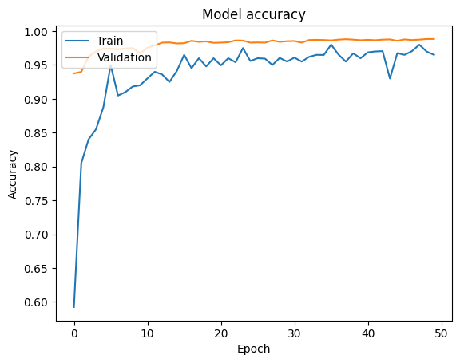

# Super Handwritten Digit Recognition

**Project by:** Ouassim HAMDANI

**Class:** Master 1 IIA -  Multi-source Data Extraction

**Date:** November 5, 2024

## 1. Introduction

This project focuses on the classic problem of handwritten digit recognition. The goal is to develop a machine learning model capable of accurately classifying images of handwritten digits (0-9). This task has numerous real-world applications, including:

* **Automated mail sorting:** Reading handwritten zip codes on envelopes.
* **Check processing:** Recognizing handwritten digits on checks.
* **Form data entry:**  Automating the digitization of handwritten forms.

This report details the process of building and evaluating a model for this task using the MNIST dataset.

## 2. Problem Statement

The problem addressed in this project is a **multi-class classification** problem. Given an image of a handwritten digit, the model must assign it to one of ten classes (0, 1, 2, ..., 9).  This project utilizes the data and problem definition from the Kaggle competition "Digit Recognizer" ([link to Kaggle competition](https://www.kaggle.com/c/digit-recognizer)).

## 3. Dataset

The dataset used for this project is the **MNIST** (Modified National Institute of Standards and Technology) dataset, a widely used benchmark in computer vision. It consists of **42,000** grayscale images of handwritten digits (0-9).

Each image is `28x28` pixels, with each pixel representing a grayscale value from 0 (white) to 255 (black). The training data includes labels indicating the correct digit for each image.

**Data Format:**

The data is provided in CSV (Comma Separated Values) format, found in `Data` Folder.

* **train.csv:** Contains 785 columns.
    * `label`: The first column, representing the digit (0-9).
    * `pixel0` to `pixel783`: The remaining columns, representing the pixel values of the 28x28 image.
* **test_gen.csv:**  Similar to `train.csv`, splitted from training set, used to evaluate model on data never seen before.

**Pixel Representation:**

The pixels in the images are stored in row-major order. For example, `pixel31` corresponds to the pixel at row 1, column 3 of the 28x28 image matrix (using zero-based indexing).

**Visualization of Some Sampless:**

**Classes Balanace :**

## 4. Data Preprocessing

The following preprocessing steps were applied to the data:

* **Splitting:** The data was split into training and testing sets using an 80/20 ratio.
* **Reshaping:** The image data (pixel values) was reshaped from a flat vector of 784 pixels to a 28x28x1 matrix to represent the image structure.
* **Padding:**  The images were padded to 32x32 pixels to be compatible with the input requirements of the pre-trained models (VGG19 and ResNet50).
* **Channel Duplication:** The grayscale images (1 channel) were duplicated to have 3 channels, which is necessary for the pre-trained models.
* **Normalization:** (Optional)  Pixel values were normalized to a range of 0-1 to improve model training.

## 5. Model Selection

Two pre-trained models were selected for this project alongside a trained CNN:

* **VGG19:** A deep convolutional neural network with 19 layers, known for its good performance in image classification tasks.
* **ResNet50:** A 50-layer residual network that uses skip connections to address the vanishing gradient problem, allowing for the training of very deep networks.
* **CNN:** A convolutional neural network with three convolutional layers, each followed by a max-pooling layer, for feature extraction. The extracted features are then flattened and passed through two dense layers for classification.

These models were chosen due to their proven effectiveness in image recognition and their availability in Keras. CNN model was trained, and the other models were fine-tuned by:

* **Removing the top layers:** The original classification layers of the pre-trained models were removed, as they are specific to the ImageNet dataset.
* **Adding new layers:** New fully connected layers were added to adapt the models to the MNIST dataset and the 10-class classification task.
* **Freezing layers:** Most Layers in the  VGG19 pre-trained model were frozen to prevent their weights from being updated during training, but for the case of ResNET50, all layers were finetunned (retrained), for better task adaptation.

## 6. Model Training

The models were trained using the following settings:

* **Optimizer:** Adam optimizer with a learning rate of `0.001`.
* **Loss function:** Sparse categorical cross-entropy, suitable for multi-class classification.
* **Metrics:** `Accuracy` was used, as the data classes were good balanced.
* **Data augmentation:** `ImageDataGenerator` was used to augment the training data with random rotations, shifts, and shears to improve model generalization.
* **Epochs:** The models were trained for 50 epochs.
* **Batch size:** A batch size of 200 was used.

**Training History:**

The following plots illustrate the training and validation accuracy and loss over epochs:

**VGG 19 Training Figures**

**ResNET50 Training Figures**

**CNN Model Training Figures**

No large overfitting was detected, thus no need for L1, L2 regulization, or dropout method.

## 7. Model Evaluation

* **VGG19:** Achieved an accuracy of `97.67%` on the test set. (Max was `98.7%` when all layers were fully trained, we stayed with the first result)
* **ResNet50:** Achieved an accuracy of `98.05%` on the test set.

* **CNN Model:** Achieved an accuracy of `99.10%` on the test set.

## 8. Model Ensembling

To further improve performance, the models were ensembled by averaging their predictions. This resulted in an accuracy of **99.20%** on the test set.

## 9.  Analysis of Errors

A confusion matrix was generated to analyze the types of errors made by the ensembled model. It revealed that the most common confusion was between digits similiar in handwritten shape (8,9) (1,7)...etc, which is understandable as these digits can have similar appearances in handwritten form.

**Visualizations of some predictions made by model :**

## 10. Conclusion

This project successfully demonstrated the effectiveness of transfer learning and model ensembling for handwritten digit recognition. By fine-tuning pre-trained VGG19 and ResNet50 models alongside training a full CNN model, and combining their predictions, a high accuracy of ``99.20%`` was achieved on the MNIST dataset.

**Potential improvements (Why not?):**

* **Hyperparameter tuning:** Explore different hyperparameter settings (e.g., learning rate, number of layers added, batch size) to potentially improve performance.
* **Different architectures:** Experiment with other pre-trained models or custom CNN architectures.
* **More data augmentation:**  Apply more aggressive data augmentation techniques or use a larger dataset.
* **Adding a 'Not A Number' Class** : Since the only output the model can give is number, it will classify anything to a number, adding this class and retraining model on it, will let model be able to detect when non numbers are inserted.

